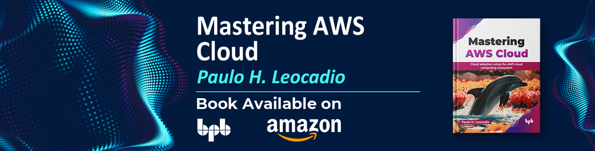

# Mastering AWS Cloud

 
 

 
[published by BPB Publishing, © 2025](https://www.bpbonline.com "BPB Publications Homepage")
 

 
 

__Pre-print v2 - November 14, 2025__      
This repo stores a preprint version of the book and has not been peer reviewed. Data may be preliminary.      

__PER CHAPTER PRE-PRINT DOI__ — _Please refer to the table below_      
Status: __Archived pre-publication draft__ (2024) — _Superseded_      

These chapters are an early developmental version later finalized and published as part of:        
Leocadio, Paulo H. (2025). Mastering AWS Cloud. BPB Publications — ISBN: 9789365890617 (Released October 28, 2025).         

A significantly updated, expanded, and editorially refined version appears in the published edition. This preprint is preserved for scholarly transparency, version tracking, and citation continuity.        
